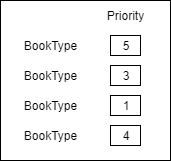

书的生命周期：

种纸草 => 制纸 => 写书 => 工作阅读/娱乐阅读 => 烧书

* 增加一种物品：纸
    * 增加一种生产建筑：制纸桌，用于由木材生成纸
        * 生产速度与手工技能相关
        * 不需要通电，也不可以通电
        * 可由金属类/木材建造制纸桌
* 增加一类物品：书
    * 增加一种生产建筑：写作桌，用于由纸生成书
    * 书具有随机的名字
    * 书具有类型属性，该属性按照比例划分成各种子类型，例如“小萌老师教你喝牛奶”，它具有60%的萌的娱乐类型，40%的喝牛奶技能的学习类型
        * 某种类型的娱乐类型：小人可以将读这类书当作该类型的娱乐
        * 某技能的学习类型：小人可以通过阅读这类书来学习该技能的知识
            * 学习类型具有名为“学习上限”的子属性，当小人持有的该技能的等级大于等于学习上限的时候，小人就无法再通过阅读这本书来提升该技能
    * 书具有质量属性，质量越高，小人单位时间内阅读书本收获的效果越高
    * 书不可以被堆叠
* 增加一种工作：写作
    * 当小人被指派为写作工作时，他会去找一个自己能进行的写作任务，推进它
    * 产出的书的质量应该小人的艺术技能相关，艺术技能的等级越高，越有可能做出高质量的书
    * 写作任务中可以指定书本的学习类型的占比
        * 若学习类型的占比不到100%，那么剩下的类型属性都会是娱乐类型
        * 学习类型的学习上限子属性等于写作任务开始时小人持有的该技能的等级
    * 娱乐类型中具体有哪些娱乐类型，会在随机书本名字时相应随机
        * 即，每一个随机出来的名字会给出一套娱乐类型的比例，该比例乘以娱乐类型的占比，即为该类型的实际占比
        * 例如，“小萌老师教你喝牛奶”配套的娱乐类型为100%的萌类型，而学习类型占比为40%，所以娱乐类型占比为60%，故萌类型的实际占比为100% * 60% = 60%
    * 写作任务的工作时间应该和学习类型的占比有关，指定的学习类型的占比越高，工作时间越长
* 增加一种工作：阅读
    * 当小人被指派为阅读工作时，他会根据自己的阅读方案寻找一本自己可以读的书
    * 找到书以后，他会试图像吃饭一样找一个位子坐着读书
    * 根据书的类型比例，小人会收获不同类型的成果
* 增加一种方案：阅读方案，也就和药物管理方案、衣着方案类似，如下图
    
    * 每个小人都可以被指定一套阅读方案
    * 阅读方案中有所有书的类型的一个列表
        * 每种类型可以被指定一个优先级，最低的优先级表示该类型被禁止
        * 小人在找书的时候会找一本对于自己而言优先级最高的那本书
            * 书的类型优先级计算方法：将书的类型按照其在阅读方案中被指定的优先级进行加权平均，结果即为书的类型优先级。例如具有60%萌的娱乐类型与40%喝牛奶技能的学习类型的一本书，若萌的优先级为1，喝牛奶技能的优先级为5，那么这本类型书的优先级即为60%\*1 + 40%\*5=2.6
            * 小人的技能等级大于等于学习类型的学习上限时有两种可选的做法，根据实现难度决定：
                1. 这部分类型依然会贡献优先级
                2. 不贡献优先级
            * 书的优先级 = 书的类型优先级 * 质量系数
                * 也就是说，书的质量越高，它的优先级就越高
    * 预设方案有三套
        1. 平均：所有类型都具有最低的1的优先级
        2. 优先学习：所有学习类型的优先级都为2，所有娱乐类型的优先级都为1
        2. 优先娱乐：所有娱乐类型的优先级都为2，所有学习类型的优先级都为1
    * 默认的方案为“平均”
* 增加一种娱乐时间会进行的行为：阅读
    * 就是说是和工作时间分开的娱乐时间的时候，小人也会去阅读
    * 在娱乐时间自发的进行的阅读会忽略阅读方案，只去找娱乐优先级最高的书来阅读，同时还会要求书的娱乐类型比例不能低于一定值，不然不进行这项娱乐
        * 娱乐优先级 = 娱乐类型的类型优先级贡献 * 质量系数